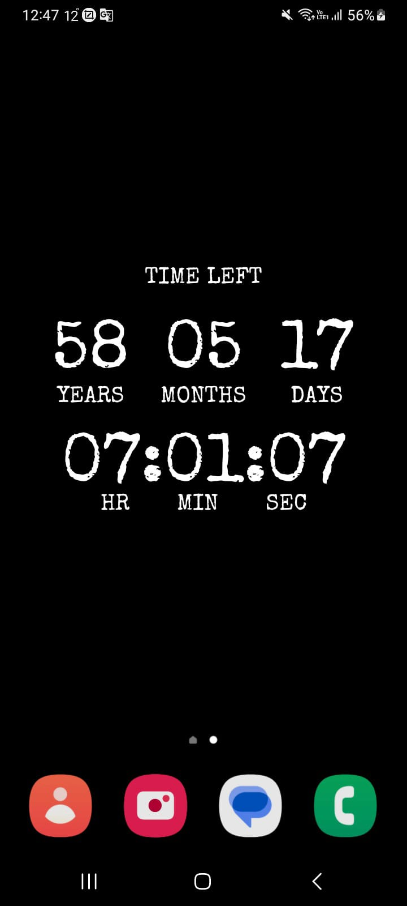
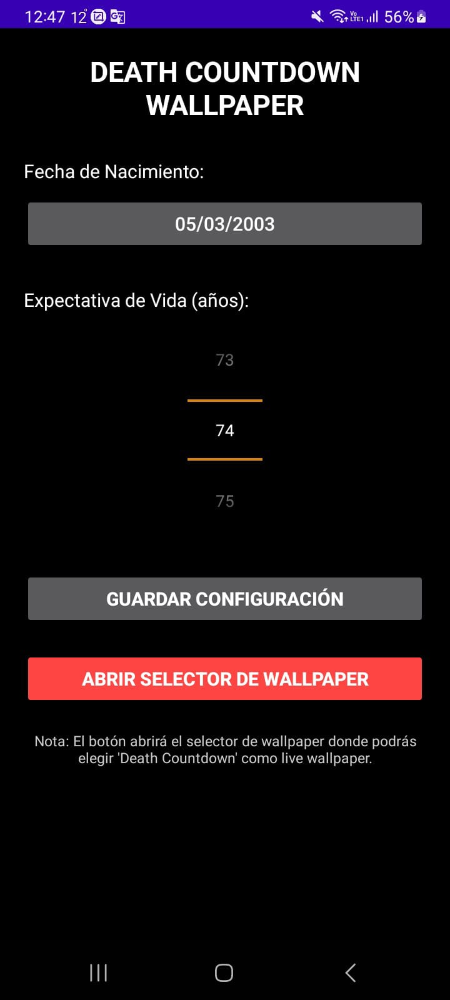

# 💀 Death Countdown Live Wallpaper

Un live wallpaper para Android que muestra el tiempo que te queda de vida basado en tu fecha de nacimiento y expectativa de vida configurada.

## 📱 Screenshots

| Live Wallpaper | Configuración |
|:-------------:|:-------------:|
|  |  |

*El wallpaper muestra en tiempo real los años, meses, días, horas, minutos y segundos restantes de tu vida estimada.*

## ⚡ Características

- 🎯 **Cálculo en tiempo real** - Actualización cada segundo del contador regresivo
- 📅 **Configuración personalizable** - Establece tu fecha de nacimiento y expectativa de vida (50-120 años)
- 🎨 **Diseño minimalista** - Texto blanco sobre fondo negro para máxima legibilidad
- 📱 **Live Wallpaper nativo** - Integración completa con el sistema Android
- 💾 **Configuración persistente** - Tus datos se guardan automáticamente
- 🔧 **Fácil instalación** - Botón integrado para acceder al selector de wallpapers

## 📋 Requisitos

- Android 4.1 (API 16) o superior
- Soporte para Live Wallpapers (la mayoría de dispositivos Android)

## 🚀 Instalación

1. Clona este repositorio:
   ```bash
   git clone https://github.com/tuusuario/death-countdown-wallpaper.git
   ```

2. Abre el proyecto en Android Studio

3. Compila e instala la aplicación en tu dispositivo

4. Abre la aplicación "Death Countdown Wallpaper"

5. Configura tu fecha de nacimiento y expectativa de vida

6. Presiona "GUARDAR CONFIGURACIÓN"

7. Presiona "ABRIR SELECTOR DE WALLPAPER" y selecciona "Death Countdown"

## 🛠️ Uso

### Configuración inicial

1. **Fecha de Nacimiento**: Selecciona tu fecha de nacimiento usando el selector de fecha
2. **Expectativa de Vida**: Ajusta el número de años que esperas vivir (50-120 años)
3. **Guardar**: Presiona el botón para guardar tu configuración
4. **Establecer Wallpaper**: Usa el botón rojo para abrir el selector de wallpapers del sistema

### Visualización del Wallpaper

El wallpaper muestra:
- **TIME LEFT** - Título principal
- **Años, Meses, Días** - En números grandes
- **Horas:Minutos:Segundos** - En formato de reloj digital
- Actualización automática cada segundo

## 🏗️ Arquitectura del Proyecto

```
src/main/java/com/deathcoutndown/app/
├── CountdownService.java      # Servicio principal del live wallpaper
├── SettingsActivity.java     # Actividad de configuración
└── SharedPrefsManager.java   # Gestión de preferencias compartidas
```

### Componentes principales

- **CountdownService**: Extiende `WallpaperService` y maneja el renderizado del countdown
- **SettingsActivity**: Interfaz de usuario para configurar fecha de nacimiento y expectativa de vida
- **SharedPrefsManager**: Utilidad para guardar y recuperar la configuración del usuario

## 🎨 Personalización

El diseño actual utiliza:
- Fuente: `Special Elite Regular`
- Colores: Texto blanco (#FFFFFF) sobre fondo negro (#000000)
- Tamaños de fuente configurables en el código

Para personalizar, modifica las constantes en `CountdownService.java`:

```java
textPaint.setColor(Color.WHITE);     // Color del texto principal
textPaint.setTextSize(120);          // Tamaño de los números grandes
labelPaint.setTextSize(40);          // Tamaño de las etiquetas
```

## 📝 Funcionalidades técnicas

- **Validación de entrada**: Verifica que la expectativa de vida sea mayor a la edad actual
- **Cálculo preciso**: Usa `Calendar` para cálculos exactos de tiempo
- **Manejo de errores**: Gestión robusta de excepciones
- **Compatibilidad**: Múltiples métodos de fallback para establecer el wallpaper
- **Optimización**: Renderizado eficiente con actualización solo cuando es visible

## 🤝 Contribuir

¡Las contribuciones son bienvenidas! Para contribuir:

1. Fork el proyecto
2. Crea una rama para tu feature (`git checkout -b feature/AmazingFeature`)
3. Commit tus cambios (`git commit -m 'Add some AmazingFeature'`)
4. Push a la rama (`git push origin feature/AmazingFeature`)
5. Abre un Pull Request

### Ideas para contribuir

- 🎨 Temas de color personalizables
- 🌍 Soporte para más idiomas
- 📊 Estadísticas adicionales (porcentaje de vida vivida, etc.)
- 🎵 Efectos de sonido opcionales
- 📱 Soporte para diferentes tamaños de pantalla
- ⚙️ Más opciones de configuración

## 📄 Licencia

Este proyecto está bajo la Licencia MIT - ver el archivo [LICENSE](LICENSE) para más detalles.

## ⚠️ Disclaimer

Este wallpaper es solo para propósitos de entretenimiento y reflexión. Los cálculos de expectativa de vida son aproximaciones y no deben considerarse predicciones médicas precisas.

## 📞 Soporte

Si encuentras algún problema o tienes sugerencias:
- 🐛 [Reportar un bug](../../issues)
- 💡 [Solicitar una feature](../../issues)
- 📧 Contacto: [tu-email@ejemplo.com]

---

⭐ **Si te gusta este proyecto, dale una estrella!**

*"El tiempo es el recurso más valioso que tenemos. Úsalo sabiamente."*